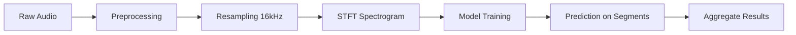
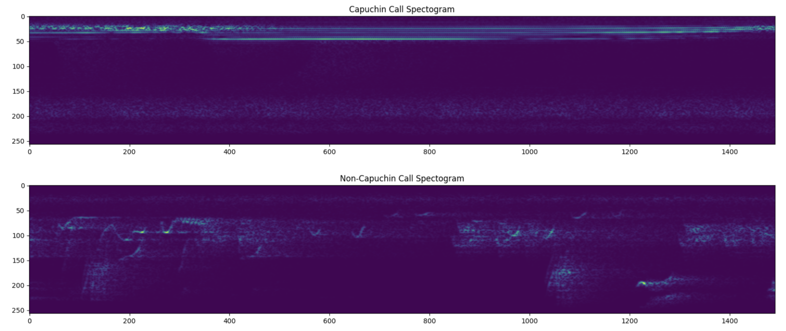

# capuchin-bird-call-classification-deep-learning-project

---

# 🐦 Echoes of the Forest: Capuchin Bird Call Classification

---

## 📌 Overview

This project builds a **deep learning pipeline for audio classification** to detect Capuchin bird calls from environmental recordings. By converting audio into spectrograms and applying CNN-based models, it enables **automated wildlife monitoring at scale**.

The approach demonstrates how machine learning can be applied to real-world conservation challenges, reducing reliance on manual observation and enabling continuous, non-invasive species tracking.

---

## 🎯 Problem

Monitoring bird populations traditionally requires:

- Manual field observation
- Time-intensive audio review
- Limited scalability across large environments

Additionally:

- Audio recordings contain significant background noise
- Bird calls are short, irregular, and variable
- Long recordings (~3 minutes) must be analyzed efficiently

---

## 💡 Solution

* Convert audio → **spectrogram images (STFT)**
* Train models to classify:

  * ✅ Capuchin calls
  * ❌ Non-Capuchin sounds
* Processes long recordings using sliding window segmentation
* Detects presence and frequency of bird calls over time

---

## 📦 Dataset

- Training Data
  - 217 Capuchin call clips (2–5 seconds)
  - 593 non-Capuchin audio clips (~3 seconds)
- Testing Data
  - 100 long recordings (~3 minutes each)
  - Mixed environmental sounds and bird species

Source: Kaggle 
https://www.kaggle.com/code/pranshavpatel/capuchinbird-audio-classification/input

---

## 🔄 Pipeline

1. Audio Preprocessing
- Convert audio → mono
- Resample to 16 kHz
- Standardize clip length (padding/trimming)
2. Feature Engineering
- Transform waveform → spectrogram (STFT)
- Create 2D image representation for CNN input
3. Long Audio Handling
- Split recordings into fixed-length windows
- Classify each segment independently
- Aggregate predictions across time

---

## 🧠 Models

### 🔹 Custom CNN

* Lightweight architecture
* Fast training
* Strong generalization
* Conv2D → ReLU → MaxPooling
* Multiple convolutional layers for feature extraction
* Dense layers with sigmoid output

### 🔹 ResNet-50 (Transfer Learning)

* High accuracy (98.8%)
* Higher computational cost
* Pretrained on ImageNet
* Modified to accept single-channel spectrograms
* Fine-tuned for binary classification

---

## 📊 Results

| Model      | Accuracy | Precision | Recall | Speed  |
| ---------- | -------- | --------- | ------ | ------ |
| Custom CNN | ~100%    | 1.00      | 1.00   | Fast   |
| ResNet-50  | 98.8%    | High      | High   | Slower |

**Both models perform extremely well**

Custom CNN slightly outperforms in:
 - Speed
 - Call count estimation
 
ResNet excels in:
 
 - General classification accuracy

---

## 🖼️ Visualizations

### Spectrogram Comparison

  

**Insight:**

* Capuchin calls → structured, high-frequency bands
* Non-Capuchin → scattered, irregular patterns

---

### Model Architecture (Custom CNN)

  

---

### Model Architecture (ResNet-50)

  

---

## 🌍 Impact

* Enables **automated biodiversity monitoring**
* Reduces need for manual audio analysis
* Supports **real-time conservation decision-making**
* Scalable to:

  * Other bird species
  * Marine bioacoustics
  * Environmental monitoring systems

---

## ⚙️ Tech Stack

* Python
* TensorFlow / Keras
* Librosa
* NumPy / Pandas
* Matplotlib

---

## 🚀 Key Takeaways

* Spectrograms enable **image-based deep learning on audio**
* CNNs are highly effective for **bioacoustic classification**
* Simpler models can outperform complex architectures in practice
* Transfer learning remains powerful but resource-intensive

---
